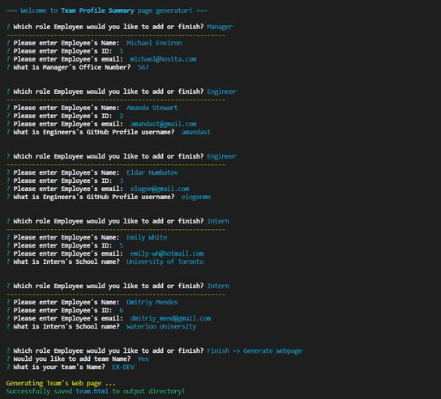

# Team Profile Summary generator.  

  **Team Profile Summary Generator** - Node CLI application that takes in information about employees and generates an HTML webpage that displays summaries for each person in team.
  
## Contents

1. [Contents](#contents)
2. [Screenshot](#screenshot)
3. [Installation](#installation)
4. [Usage](#usage)
5. [License](#license)
6. [Contributing](#contributing)
7. [Testing](#testing)
8. [Questions](#questions)

### Screenshot

## Installation

Download files from provided Repo URL. Run terminal and navigate to project folder. Make sure node is installed. Run `npm install` to install all dependencies before running app.  
Application can be accessed at [https://github.com/elogonme/team-profile-summary](https://github.com/elogonme/team-profile-summary)

## Usage

To run application run `node index.js` in the terminal. The application will prompt the user for information about the team manager and then information about the team members. It will prompt the user for their email, id, and specific information based on their role with the company. The user can input any number of team members, and they may be a mix of engineers and interns. The application will create an HTML file that displays a nicely formatted team roster based on the information provided by the user. App will generate a `team.html` page in the `output` directory.  
All app code is available at repository [https://github.com/elogonme/team-profile-summary](https://github.com/elogonme/team-profile-summary)

## License

Licensed under the 

## Contributing

See contribution guidlines below:  
This is the open project. Please feel free to contribute.

## Testing

For testing follow guidlines below:  
Unit tests are provided in test folder. Make sure to `npm install` to install [jest](https://jestjs.io/) test package. To test application run the tests from CLI with `npm run test`.

## Questions

For any questions use contacts below:  
        :construction_worker: Developer: Eldar Humbatov  
        :email: Email: [elogon@gmail.com](mailto:elogon@gmail.com)  
        :boom: GitHub: [https://github.com/elogonme](https://github.com/elogonme)
  
  *Generated by [readme-generator](https://github.com/elogonme/readme-generator/)*
  